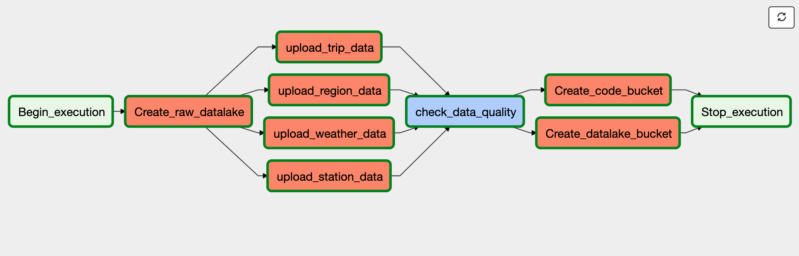
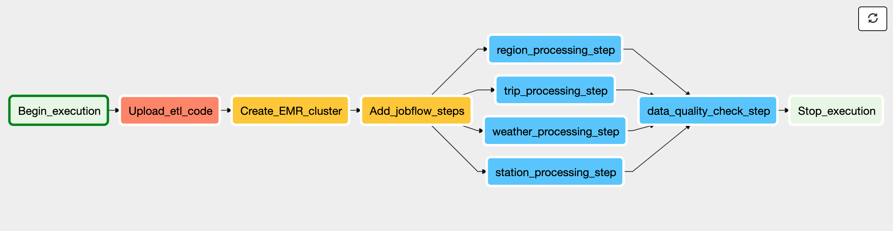
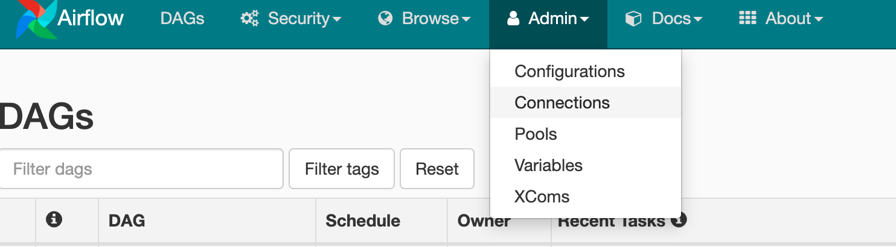

# bike-share-data-engineering

### Introduction

This is a capstone project for the Udacity DataEngineering Nanodegree. The purpose of the data engineering capstone project is to give you a chance to combine everything learned throughout the program.


#### Datasets

- [Bay Wheel trip history data](https://www.lyft.com/bikes/bay-wheels/system-data)
  - bike share trip data of Bay Wheel from January 2019 to March 2020, over 3 millilon rows
- [Bay Wheel station data](https://www.lyft.com/bikes/bay-wheels/system-data)
  - 454 rows
- [Bay wheel region data](https://www.lyft.com/bikes/bay-wheels/system-data)
  - 6 rows
- [Weather data](https://api.meteostat.net/#history)
  - over 1000 rows

#### Goal

The goal of this project is to create a data pipeline for cleaning, transforming and loading bike share data from Bay Wheel. The users would be able to bike traffic given the knowledge of station information, time information, region information and weather information.


#### Technologies

The raw dakelake which stores raw data is created on AWS S3. S3 is known for its easy-to-use management features so anyone can organize data and configure finely-tuned access controls to meet specific business, organizational, and compliance requirements.


Apache Spark is used for our ETL pipeline. I spinned up a Spark cluster on EMR. Spark is a memory-based dributed computation architeture.


The last piece is Apache Airflow, which is used to connect all the component of our pipeline and orchestrate it. Airflow has an built-in UI and we are able to tract the whole processing and troubshoot with the logs of the pipeline.


### Data Quality

##### trip_data

The trip dataset includes more columns than we need. columns such as, start_station_name, start_station_longitude, and start_station_latitude would be removed as station dataset already has these information. 


Also the trip dataset includes records with null station information, these records needs to be filtered as we need station information to compute traffic.

##### station_data

The station dataset includes unnecessary columns and will be removed.

##### weather_data

The weather dataset is acquired with [API](https://api.meteostat.net/#history)

As the stations distribute across different cities in San Francisco Bay Area, we need to get the weather information of all these citites. We gengerated the weather dataset with the following steps:

- Extract latitude and longitude information from the station dataset
- Use the latitude and longitude information to get the nearest weather station with the API
- Obtain the weather data of all the weather stations with the API, the result shows that we only need to get the weather data from 5 weather stations
  - 74506
  - KSJC0
  - 72494
  - 72493
  - KRHV0

##### region_data

The region dataset is small and complete. No action is needed.

## Data Model

We created 2 separate buckets on AWS S3 for storing raw data and optimized data.

1. **shuaishao-raw-datalake**
   - This bucket has 4 folders storing trip data, station data, weathe data and region data respectively
2. **shuaishao-bikeshare-datalake**
   - This bucket is used to stored optimized datasets, we are using star schema with 1 fact table and 5 dimension table

#### Schema

**Fact table**

1. trips
   - duration(sec): int; duration of a trip;
   - start_time; datetime; start time of a trip; Primary Key
   - end_time; datetime; end time of a trip
   - start_station_id; int; id of start station; Foreign Key
   - end_station_id; int; id of end station; Foreign Key
   - bike_id; int; id of bike
   - user_type; string; type of user

**Dimension tables**

1. stations
- station_id; int; Primary Key
   - station_short_name; string; station short name
   - station_external_id; string
   - station_has_kiosk; bool
   - station_rental_methods; list
   - station_capacity; int
   - station_region_id; int; Foreign Key
   - station_type; string
   - station_name; string
   - station_longitude; float
   - station_latitude; float
   - weather_station_id; strin; Foreign Key
2. start_time
   - start_time; timestamp; Primary Key
   - start_year; int
   - start_month; int
   - start_dayofyear; int
   - start_dayofmonth; int
   - start_week;int
   - start_dayofweek; int
   - start_hour; int
3. end_time
   - end_time; timestamp; Primary Key
   - end_year; int
   - end_month; int
   - end_dayofyear; int
   - end_dayofmonth; int
   - end_week;int
   - end_dayofweek; int
   - end_hour; int
4. weather

   - station; string; Primary Key
   - data; date
   - temperature; float
   - temperature_min; float
   - temperature_max; float
   - precipitation; float
   - winddirection; float
   - windspeed; float
   - pressure; float
5. regions
   - region_id; int; Primary Key
   - region_name; string

#### Data Pipeline

The pipelien include two DAGs.


1. The first DAG is for creating buckets for storing raw data, python script, optimized data, and checking data quality.




2. The second DAG is for running ETL on raw data and generated optimized data, and cheking data quality of optimized data.



### Getting started

#### Use cases

- The optimized dataset can be queried by using Amazon Athena or Apache Spark.
  - Be able to know cycling route by popularity to help maintenance. For example, if we know that the route from A station to B station is the most popular route, we would consider:
    - Increasing bike at A station (increasing capacity)
    - Deploying more stations around A station
- The optimized data can also be fetched and written into a database (e.g., MySQL, PostgreSQL, Neo4j)
  - The dataset could be written into Neo4j for visualizing cycling route (e.g., stations are nodes and routes are edges)

##### Step 1: Clone repository to local machine

```shell
git clone https://github.com/shao-shuai/bike-share-data-engineering.git
```

##### Step2: Create python virtual environment

```shell
python3 -m venv venv             # create virtualenv
source venv/bin/activate         # activate virtualenv
pip install -r requirements.txt  # install requirements
```

##### Step 3: Download the dataset

[dataset link](https://drive.google.com/open?id=1YgopJeEfGrMlxLWe9pBDvSTn_NsVHjFc)

create a directory called `dataset` in this repo.

##### Step 4: Start Airflow Container

```
docker-compose up

```

##### Step 5: Start Ariflow UI

Visit the path [http://localhost:8080](http://localhost:8080/) in your browser. Login to Airflow.

Username: user

Password: password

##### Step 6: Configure Airflow connections

1. Click connections under Admin tag



2. Select create under connections
3. On the create connection page, enter the following values:

- Conn Id: Enter aws_credentials.
- Conn Type: Enter Amazon Web Services.
- Login: Enter your Access key ID from the IAM User credentials.
- Password: Enter your Secret access key from the IAM User credentials.
- Extra: Add the default region name. { "region_name": "us-west-2" }

##### Step 7: Change default EMR config in Airflow

1. Click on the Admin tab and select Connections.
2. Select the 'emr_default' connection
3. Copy everything from `src/helper/emr_default.json` and paste into the field 'Extra'
4. Click save

##### Step 8: Start raw_datalake_dag

This DAG creates all buckets and uploads raw data. The DAG takes about 10 minutes.

##### Step 9: Start bike_data_etl_dag

This pipeline extracts the data from raw data bucket, transforms it with Spark cluster on EMR and writes it back to S3. The pipeline takes about 1 hour.

### Addressing Other Scenarios

1. The data was increased by 100x
   - Currently we are using m4large for EC2 instances, if the data increases by 100x, I would conside using m5large or m5xlarge.
   - Now we are using 3 workers, adding more workers would be another option.
   - Currently Airflow is running on a single container on my laptop. In a production environment, deploying Airflow on a Kubernetes coordinated cluster would be a better solution.
2. The pipelines would be run on a daily basis by 7 am every day.
   - We would be able to doing by scheduling Airflow
3. The database needed to be accessed by 100+ people.
   - If the performance is down with more users, we could conside using Redshift.


### Special thanks

Thanks [brfulu](https://github.com/brfulu/us-accidents-data-engineering), I learned a lot from your repo including code readability and well organized documentation.

